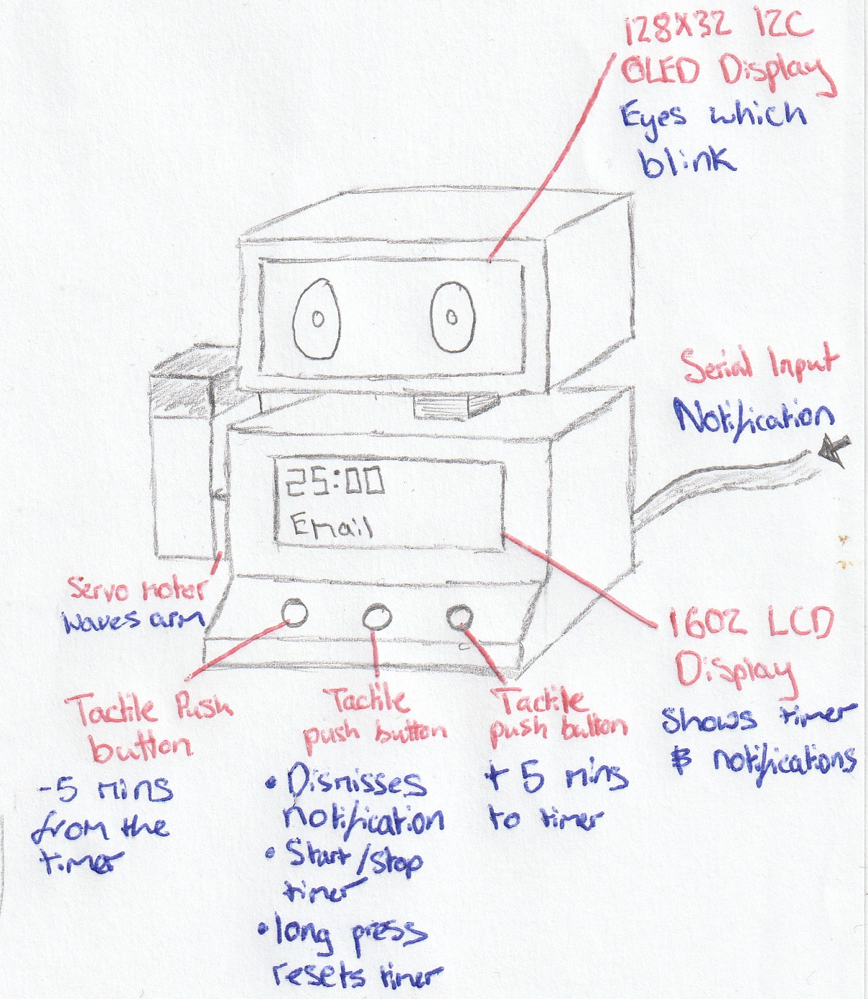
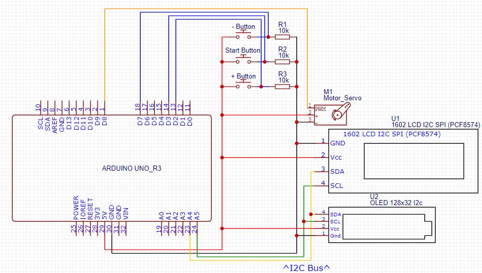
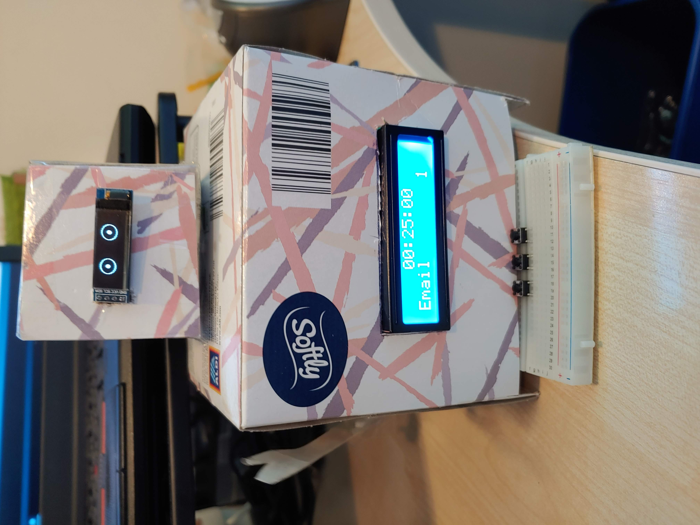
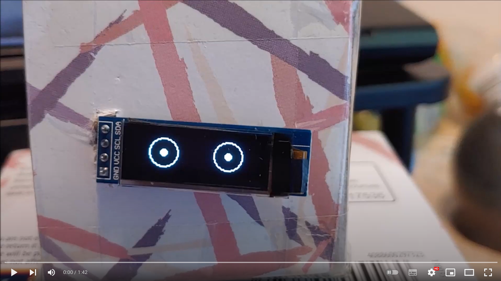

# Animatronic Desktop Assistant

## Table of Contents

- [Introduction](#introduction)
- [Brief](#brief)
- [Initial Design](#initial-design)
- [Circuitry](#circuitry)
- [Completed Prototype](#completed-prototype)
- [Demonstration](#demonstration)
- [Further Work](#further-work)

## Introduction

I completed this project during my first year at university. The aim of the challenge was to design and build an animatronic desktop assistant. The enclosure for the project also had to be made from recycled materials. In the future, I plan to re-visit this project.

## Brief

I set myself the goal of creating a friendly robot that waves at me when I have a notification. I also wanted to include a timer to help me use the pomodoro technique when working. This technique involves working for roughly 25 minutes and then taking a 5 minute break. It has been shown that using this method improves concentration and helps people to study/work more efficiently. Exactly what university students need!

## Initial Design

 

## Circuitry

 

## Completed Prototype

 

## Demonstration

## Further Work

In the future I would make several changes to improve the robot:
- Instead of the 1602 LCD I would use a 128x64 OLED display because it is smaller in size and has better contrast. 
- I would add another 128x32 OLED display to the face to create a mouth. This would allow the face to be more expressive.
- I would add more facial expressions to make the robot seem more “human”.
- I would switch to using an Wemos D1 Mini to make the circuitry smaller.
- Using the Wemos D1 I would recieve the notifications over wi-fi.
- I would make the circuitry more permanent by desgning a PCB for it.
- I would 3D print a custom enclosure to make the robot more rigid and permanent.
